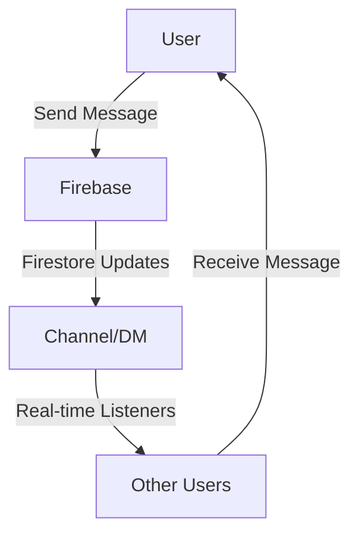

# SlackClone

## 概要
SlackCloneは、Slackのようなメッセージングアプリケーションを模倣したプロジェクトです。Firebaseを活用したリアルタイムチャット機能と、React/TypeScriptベースのモダンなUI/UXを提供します。

## 特徴
- Googleアカウントを使ったユーザー認証
- チャンネルベースのメッセージング
- ダイレクトメッセージ（DM）機能
- リアルタイム更新
- メッセージの編集と削除
- ワークスペース管理

## このプロジェクトを通して学べること・習得できること
- TypeScriptの基本と応用
- Reactコンポーネントの設計とライフサイクル
- Reduxを使った状態管理
- TailwindCSSによるスタイリング
- Firebaseとの連携（Authentication, Firestore）
- ファイル構造の整理と保守性の高いコード設計
- Material UIコンポーネントの活用



## 技術スタック
- フロントエンド: React, TypeScript, Redux Toolkit
- UIライブラリ: Material UI, TailwindCSS
- バックエンド: Firebase (Firestore, Authentication)
- 状態管理: Redux
- 開発環境: Docker

## 必要条件
- Node.js
- npm または yarn
- Firebase アカウントと設定
- Docker（オプション）

## インストール手順
1. リポジトリをクローンします。
    ```bash
    git clone https://github.com/yourusername/slackclone.git
    ```
2. 依存関係をインストールします。
    ```bash
    cd slackclone
    npm install
    ```
3. `.env`ファイルを作成し、Firebaseの設定を追加します（必要に応じて）。
4. アプリケーションを起動します。
    ```bash
    npm start
    ```
   
   または、Dockerを使用する場合：
    ```bash
    docker-compose up
    ```

## 主要な機能
- **認証機能**: Googleアカウントを使ったログイン/ログアウト
- **チャンネル管理**: チャンネルの作成、編集、削除
- **メッセージング**: テキストメッセージの送信、編集、削除
- **ダイレクトメッセージ**: ユーザー間の1対1のメッセージング
- **ユーザー管理**: オンライン状態の表示、ユーザー検索
- **ワークスペース**: 複数ワークスペースの管理と切り替え

## プロジェクト構造
- `src/app/`: Reduxストア設定
- `src/components/`: UIコンポーネント
- `src/features/`: 機能別モジュール
  - `auth/`: 認証関連
  - `channel/`: チャンネル関連
  - `message/`: メッセージ関連
  - `dm/`: ダイレクトメッセージ関連
  - `users/`: ユーザー管理関連
  - `workplace/`: ワークスペース関連
- `src/firebase/`: Firebase設定
- `src/type/`: TypeScript型定義
- `src/utils/`: ユーティリティ関数

## 貢献方法
1. リポジトリをフォークします。
2. 新しいブランチを作成します。
    ```bash
    git checkout -b feature/your-feature
    ```
3. 変更をコミットします。
    ```bash
    git commit -m 'Add some feature'
    ```
4. ブランチにプッシュします。
    ```bash
    git push origin feature/your-feature
    ```
5. プルリクエストを作成します。

## ライセンス
このプロジェクトはMITライセンスの下で公開されています。