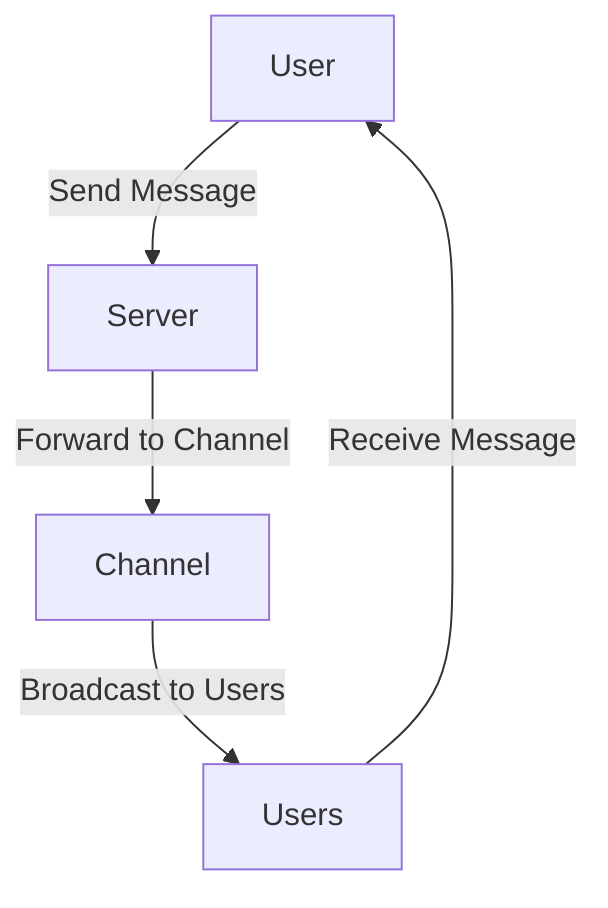

# SlackClone

## 概要
SlackCloneは、Slackのようなメッセージングアプリケーションを模倣したプロジェクトです。チーム内のコミュニケーションを円滑にし、リアルタイムでのメッセージ交換が可能です。

## 特徴
- チャット機能
- リアルタイムメッセージング
- チャンネル管理
- ユーザー管理

## このプロジェクトを通して学べること・習得できること
- TypeScriptの基本と応用
- フロントエンド開発の基礎（HTML, CSS）
- Dockerを用いたコンテナ化
- 状態管理の実践（Reduxなど）
- リアルタイム通信の実装（WebSocket）
- RESTful APIの設計と実装
- ユーザー認証と認可の実装
- テスト駆動開発（TDD）の実践



## 必要条件
- Node.js
- Docker
- npm または yarn

## インストール手順
1. リポジトリをクローンします。
    ```bash
    git clone https://github.com/yourusername/slackclone.git
    ```
2. 依存関係をインストールします。
    ```bash
    cd slackclone
    npm install
    ```
3. Dockerコンテナを起動します。
    ```bash
    docker-compose up
    ```

## 使用方法
1. アプリケーションを起動します。
    ```bash
    npm start
    ```
2. ブラウザで `http://localhost:3000` にアクセスします。

## 機能一覧
- チャット機能
- リアルタイムメッセージング
- チャンネル管理
- ユーザー管理
- メッセージの検索
- 通知機能

## 技術スタック
- フロントエンド: React, TypeScript
- バックエンド: Node.js, Express
- データベース: MongoDB
- リアルタイム通信: WebSocket
- コンテナ化: Docker

## 追加資料
- [設計図](docs/design.md)
- [APIドキュメント](docs/api.md)

## 貢献方法
1. リポジトリをフォークします。
2. 新しいブランチを作成します。
    ```bash
    git checkout -b feature/your-feature
    ```
3. 変更をコミットします。
    ```bash
    git commit -m 'Add some feature'
    ```
4. ブランチにプッシュします。
    ```bash
    git push origin feature/your-feature
    ```
5. プルリクエストを作成します。

## ライセンス
このプロジェクトはMITライセンスの下で公開されています。